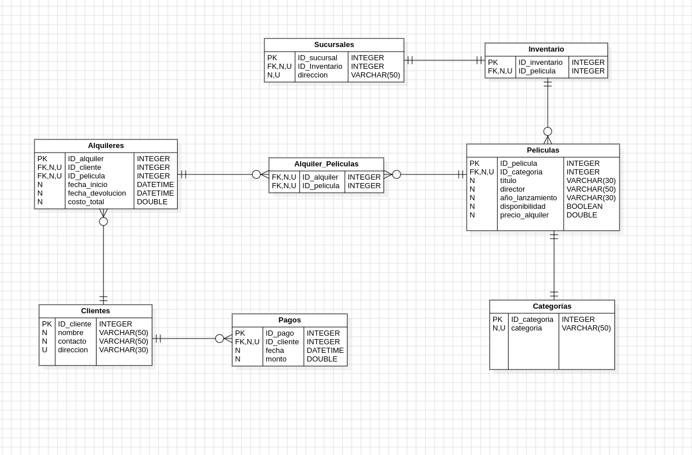

# 🎥🎞️ MovieRental - Gestión de Alquiler de Películas📽️🎬

Esta es una base de datos para una aplicación de gestión de alquiler de películas. 

### esta base de datos tiene las siguientes tablas:

- **Películas** : Esta tabla almacena información sobre las películas disponibles para alquilar.

- **Clientes** : Esta tabla almacena información sobre los clientes que alquilan películas.

- **Alquileres** : Esta tabla almacena información sobre los alquileres realizados por los clientes.

- **Pagos** : Esta tabla almacena información sobre los pagos realizados por los clientes por los alquiler

- **Categorias** : Esta tabla almacena información sobre los distintos generos de películas

- **Sucursales** : Esta tabla almacena información sobre la ubicacion de cada sucursal

- **Inventario** : Esta tabla almacena información sobre la cantidad de copias de cada película en cada sucursal

- **Alquiler_Peliculas** : Esta tabla es la union para la relacion de muchos a muchos entre alquileres y películas

## Diagrama ER 📃

